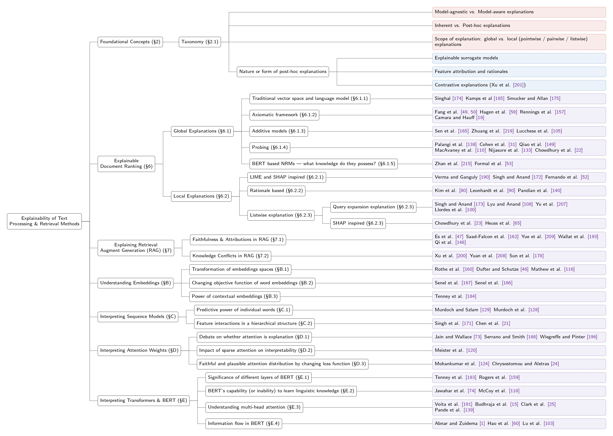

# 🚀 Explainability of Text Processing and Retrieval Methods

<div align="center">

[](https://opensource.org/licenses/MIT)
[](https://dl.acm.org/doi/pdf/10.1145/3801957)
[](https://arxiv.org/abs/2212.07126)
[](https://makeapullrequest.com)

</div>

## 🌟 About This Repo
This is the official repository for the survey paper: **[Explainability of Text Processing and Retrieval Methods: A Survey](https://dl.acm.org/doi/pdf/10.1145/3801957)**, accepted in **ACM Computing Surveys (CSUR)**. 

This repository curates a comprehensive, continuously updated list of papers, resources, and tools related to the explainability and interpretability of Information Retrieval (IR) and Natural Language Processing (NLP) methods. It covers approaches from explaining traditional statistical models to Neural Ranking Models (NRMs), and modern Retrieval-Augmented Generation (RAG) systems.

## ⚡️ News
- **[2026/02]** 🎉 Our survey paper has been accepted and published in *ACM Computing Surveys*!
- **[2026/04]** 🚀 We released this Awesome list to track the latest research in Explainable Text Processing and IR.

## 🌳 Contents
- [🌟 About This Repo](#-about-this-repo)
- [📖 Cite Our Work](#-cite-our-work)
- [📚 Overview of the Survey](#-overview-of-the-survey)
- [📑 Paper List](#-paper-list)
  - [1. Categorising Explanation Methods](#1-foundational-concepts--taxonomies)
  - [2. Basic Methods for Constructing Post-hoc Explanations](#2-basic-posthoc-methods)
    - [2.1 Using probing classifiers to construct global explanations](#21-probing-global-explanations)
    - [2.2 Model-agnostic, local explanations](#22-model-agnostic-local-explanations)
  - [3. Evaluating explanations](#3-evaluate-explanations)
  - [4. Document Ranking](#4-document-ranking)
    - [4.1 Global explanations](#41-global-explanations)
    - [4.2 Local explanations](#42-local-explanations)
  - [5. Retrieval Augmented Generation (RAG)](#5-retrieval-augmented-generation-rag)
    - [5.1 Faithfulness and Attributions in RAG](#51-faithfulness-and-attributions-in-rag)
    - [5.2 Knowledge Conflicts in RAG](#52-knowledge-conflicts-in-rag)
  - [B. Understanding Embeddings](#b-understanding-embeddings)
    - [B.1 Transformation of embeddings spaces](#b1-transformation-of-embeddings-spaces)
    - [B.2 Changing objective function of word embeddings](#b2-changing-objective-function-of-word-embeddings)
    - [B.3 Power of contextual embeddings](#b3-power-of-contextual-embeddings)
  - [C. Interpreting Sequence Models](#c-interpreting-sequence-models)
    - [C.1 Predictive power of individual words](#c1-predictive-power-of-individual-words)
    - [C.2 Feature interactions in a hierarchical structure](#c2-feature-interactions-in-a-hierarchical-structure)
  - [D. Interpreting Attention Weights](#d-interpreting-attention-weights)
    - [D.1 Debate on Whether Attention is Explanation](#d1-debate-on-whether-attention-is-explanation)
    - [D.2 Impact of sparse attention on interpretability](#d2-impact-of-sparse-attention-on-interpretability)
    - [D.3 Faithful and plausible attention distribution by changing loss function](#d3-faithful-and-plausible-attention-distribution-by-changing-loss-function)
  - [E. Interpreting Transformers and BERT](#e-interpreting-transformers-and-bert)
    - [E.1 Significance of different layers of BERT](#e1-significance-of-different-layers-of-bert)
    - [E.2 BERT's capability (or inability) to learn linguistic knowledge](#e2-bert's-capability-or-inability-to-learn-linguistic-knowledge)
    - [E.3 Understanding multi-head attention](#e3-understanding-multi-head-attention)
    - [E.4 Information flow in BERT](#e4-information-flow-in-bert)
- [🛠️ Tools & Libraries](#️-tools--libraries)
- [👏 Welcome to discussion (Contributing)](#-welcome-to-discussion-contributing)


<div align="center">
  <a href="taxonomy.pdf" target="_blank">
    
  </a>
  <p><em>Fig 1. Taxonomy of Explainable Text Processing and Retrieval Methods. (Click the image to view the high-res PDF)</em></p>
</div>

---

## 📖 Cite Our Work
If you find our survey or this repository helpful in your research, please consider citing our paper:
```bibtex
@article{10.1145/3801957,
author = {Saha, Sourav and Majumdar, Debapriyo and Mitra, Mandar},
title = {Explainability of Text Processing and Retrieval Methods: A Survey},
year = {2026},
issue_date = {August 2026},
publisher = {Association for Computing Machinery},
address = {New York, NY, USA},
volume = {58},
number = {11},
issn = {0360-0300},
url = {https://doi.org/10.1145/3801957},
doi = {10.1145/3801957},
journal = {ACM Comput. Surv.},
month = may,
articleno = {284},
numpages = {48},
keywords = {Explainability, interpretability, text processing, information retrieval, natural language processing, machine learning}
}
```
# 📑 PaperList

## 1. Categorising Explanation Methods

## 2. Basic Methods for Constructing Post-hoc Explanations

## 3. Evaluating explanations

## 4. Document Ranking

### 4.1 Global explanations

- **Term Weighting Revisited (Singhal).**
  
  Thesis 1997. [[Paper](https://ecommons.cornell.edu/server/api/core/bitstreams/ac2f078e-3307-454f-89dc-26693c44b4f3/content)]

- **The importance of length normalization for XML retrieval (Kamps et al.).**
  
  IR Journal 2005. [[Paper](https://doi.org/10.1007/s10791-005-0750-7)]

- **An investigation of dirichlet prior smoothing’s performance advantage (Smucker and Allan).**
  
  Technical Report 2025. [[Paper](https://maroo.cs.umass.edu/getpdf.php?id=694)]

- **A Formal Study of Information Retrieval Heuristics (Fang et al.).**
  
  SIGIR 2004. [[Paper](https://doi.org/10.1145/1008992.1009004)]

- **Diagnostic Evaluation of Information Retrieval Models (Fang et al.).**
  
  TOIS 2011. [[Paper](https://doi.org/10.1145/1961209.1961210)]

- **Axiomatic Result Re-Ranking (Hagen et al.).**
  
  CIKM 2016. [[Paper](https://doi.org/10.1145/2983323.2983704)]

- **An Axiomatic Approach to Diagnosing Neural IR Models (Rennings et al.).**
  
  ECIR 2020. [[Paper](https://doi.org/10.1007/978-3-030-15712-8_32)]

- **The curious case of IR explainability: Explaining document scores within and across ranking models (Sen et al.).**
  
  SIGIR 2020. [[Paper](https://doi.org/10.1145/3397271.3401286)]

- **Interpretable ranking with generalized additive models (Zhuang et al.).**
  
  WSDM 2021. [[Paper](https://doi.org/10.1145/3437963.3441796)]

- **ILMART: Interpretable ranking with constrained LambdaMART (Lucchesse et al.).**
  
  SIGIR 2022. [[Paper](https://doi.org/10.1145/3477495.3531840)]

- **Deep sentence embedding using long short-term memory networks: Analysis and application to information retrieval (Palangi et al.).**
  
  TASLP 2016. [[Paper](https://doi.org/10.1109/TASLP.2016.2520371)]

- **Understanding the representational power of neural retrieval models using NLP tasks (Cohen et al.).**
  
  ICTIR 2018. [[Paper](https://doi.org/10.1145/3234944.3234959)]

- **Understanding the behaviors of BERT in ranking (Qiao et al.).**
  
  Arxic 2019. [[Paper](https://arxiv.org/abs/1904.07531)]

- **BNIRML: Analyzing the behavior of neural IR models (MacAvaney et al.).**
  
  TACL 2022. [[Paper](https://doi.org/10.1162/tacl_a_00457)]

- **How Relevance Emerges: A Mechanistic Analysis of LoRA Fine-Tuning in Reranking LLMs (Nijasure et al.).**
  
  SIGIR 2025 Workshop. [[Paper](https://arxiv.org/pdf/2504.08780)]

- **Probing ranking LLMs: A mechanistic analysis for information retrieval (Chowdhury et al.).**
  
  ICTIR 2025. [[Paper](https://doi.org/10.1145/3731120.3744603)]

- **An analysis of BERT in document ranking (Zhan et al.).**
  
  SIGIR 2020. [[Paper](https://doi.org/10.1145/3397271.3401325)]

- **A white box analysis of ColBERT (Formal et al.).**
  
  ECIR 2021. [[Paper](https://hal.sorbonne-universite.fr/hal-03364396)]


### 4.2 Local explanations

- **LIRME: Locally Interpretable Ranking Model Explanation (Verma and Ganguly).**
  
  SIGIR 2019. [[Paper](https://doi.org/10.1145/3331184.3331377)]

- **EXS: Explainable Search Using Local Model Agnostic Interpretability (Singh and Anand).**
  
  WSDM 2019. [[Paper](https://doi.org/10.1145/3289600.3290620)]

- **A Study on the Interpretability of Neural Retrieval Models Using DeepSHAP (Fernando et al.).**
  
  SIGIR 2019. [[Paper](https://doi.org/10.1145/3331184.3331312)]

- **Alignment rationale for query-document relevance (Kim et al.).**
  
  SIGIR 2022. [[Paper](https://doi.org/10.1145/3477495.3531883)]

- **Extractive explanations for interpretable text ranking (Leonhardt et al.).**
  
  TOIS 2023. [[Paper](https://doi.org/10.1145/3576924)]

- **Evaluating the explainability of neural rankers (Pandian et al.).**
  
  ECIR 2024. [[Paper](https://doi.org/10.1007/978-3-031-56066-8_28)]

- **Model agnostic interpretability of rankers via intent modelling (Singh and Anand).**
  
  FAT 2020. [[Paper](https://doi.org/10.1145/3351095.3375234)]

- **Listwise explanations for ranking models using multiple explainers (Lyu and Anand).**
  
  ECIR 2023. [[Paper](https://doi.org/10.1007/978-3-031-28244-7_41)]

- **Towards explainable search results: A listwise explanation generator (Yu et al.).**
  
  SIGIR 2022. [[Paper](https://doi.org/10.1145/3477495.3532067)]

- **Explain like i am BM25: Interpreting a dense model’s ranked-list with a sparse approximation (Llordes et al.).**
  
  SIGIR 2023. [[Paper](https://doi.org/10.1145/3539618.3591982)]

- **Shapley value based feature attributions for learning to rank (Chowdhury et al.).**
  
  ICLR 2025. [[Paper](https://openreview.net/forum?id=4011PUI9vm)]

- **Faithful listwise feature attribution explanations for ranking models (Heuss et al.).**
  
  SIGIR 2025. [[Paper](https://doi.org/10.1145/3726302.3729971)]


## 5. Retrieval Augmented Generation (RAG)

### 5.1 Faithfulness and Attributions in RAG

- **Automated evaluation of retrieval augmented generation (Es et al.).**
  
  EACL 2024. [[Paper](https://aclanthology.org/2024.eacl-demo.16/)]

- **ARES: An automated evaluation framework for retrieval-augmented generation systems (Saad-Falcon et al.).**
  
  NAACL 2024. [[Paper](https://aclanthology.org/2024.naacl-long.20/)]

- **Automatic evaluation of attribution by large language models (Yue et al.).**
  
  EMNLP 2023. [[Paper](https://openreview.net/forum?id=jVa7tFQw9N)]

- **Correctness is not faithfulness in retrieval augmented generation attributions (Wallat et al.).**
  
  ICTIR 2025. [[Paper](https://doi.org/10.1145/3731120.3744592)]

- **Model internals-based answer attribution for trustworthy retrieval-augmented generation (Qi et al.).**
  
  EMNLP 2024. [[Paper](https://aclanthology.org/2024.emnlp-main.347/)]


### 5.2 Knowledge Conflicts in RAG

- **Knowledge conflicts for LLMs: A survey (Xu et al.).**
  
  EMNLP 2024. [[Paper](https://aclanthology.org/2024.emnlp-main.486/)]

- **Discerning and resolving knowledge conflicts through adaptive decoding with contextual information-entropy constraint (Yuan et al.).**
  
  ACL 2024. [[Paper](https://aclanthology.org/2024.findings-acl.234/)]

- **CONFLICTBANK: A benchmark for evaluating knowledge conflicts in large language models (Su et al.).**
  
  Neurips 2024. [[Paper](https://openreview.net/forum?id=wjHVmgBDzc)]


## B. Understanding Embeddings

### B.1 Transformation of embeddings spaces

- **Ultradense word embeddings by orthogonal transformation (Rothe et al.).**
  
  NAACL 2016. [[Paper](https://aclanthology.org/N16-1091)]

- **Analytical methods for interpretable ultradense word embeddings (Dufter and Schtuze).**
  
  EMNLP 2019. [[Paper](https://aclanthology.org/D19-1111)]

- **The POLAR framework: Polar opposites enable interpretability of pre-trained word embeddings (Mathew et al.).**
  
  WWW 2020. [[Paper](https://doi.org/10.1145/3366423.3380227)]

### B.2 Changing objective function of word embeddings

- ** mparting interpretability to word embeddings while preserving semantic structure (Senel et al.).**
  
  Natural Language Engineering 2021. [[Paper](http://dx.doi.org/10.1017/S1351324920000315)]

- **Learning interpretable word embeddings via bidirectional alignment of dimensions with semantic concepts (Senel et al.).**
  
  Information Processing Management 2022. [[Paper](https://www.sciencedirect.com/science/article/pii/S0306457322000498)]


### B.3 Power of contextual embeddings

- **What do you learn from context? Probing for sentence structure in contextualized word representations (Tenney et al.).**
  
  ICLR 2019. [[Paper](https://openreview.net/forum?id=SJzSgnRcKX)]

## C. Interpreting Sequence Models

### C.1 Predictive power of individual words

- **Automatic rule extraction from long short term memory networks (Murdoch and Szlam).**
  
  ICLR 2017. [[Paper](https://openreview.net/forum?id=SJvYgH9xe)]

- **Beyond word importance: Contextual decomposition to extract interactions from LSTMs (Murdoch et al.).**
  
  ICLR 2018. [[Paper](https://openreview.net/forum?id=rkRwGg-0Z)]

### C.2 Feature interactions in a hierarchical structure

- **Hierarchical interpretations for neural network predictions (Singh et al.).**
  
  ICLR 2019. [[Paper](https://openreview.net/forum?id=SkEqro0ctQ)]

- **Generating hierarchical explanations on text classification via feature interaction detection (Chen et al.).**
  
  ACL 2020. [[Paper](https://aclanthology.org/2020.acl-main.494)]


## D. Interpreting Attention Weights

### D.1 Debate on Whether Attention is Explanation 

### D.2 Impact of sparse attention on interpretability

### D.3 Faithful and plausible attention distribution by changing loss function


## 🛠️ Tools & Libraries

### 
- **ir_explain - A Python Library of Explainable IR Methods (Saha et al.).**
  
  SIGIR 2025. [[Paper](https://dl.acm.org/doi/10.1145/3726302.3730343)]

- **I-REX - An interactive tool built on top of Lucene, providing a systematic view into the inner workings of retrieval models (Roy et al.).**
  
  CIKM 2029. [[Paper](https://dl.acm.org/doi/10.1145/3357384.3357859)]

- **Captum - Model interpretability and understanding tool for PyTorch. (Kokhlikyan et al.).**
  
  ICLR 2021. [[Paper](https://arxiv.org/abs/2009.07896)] [[Library](https://github.com/meta-pytorch/captum)]

- **The Language Interpretability Tool: Extensible, Interactive Visualizations and Analysis for NLP Models. (Tenney et al.).**
  
  EMNLP 2020. [[Paper](https://aclanthology.org/2020.emnlp-demos.15/)] [[Library](https://pair-code.github.io/lit/)]
